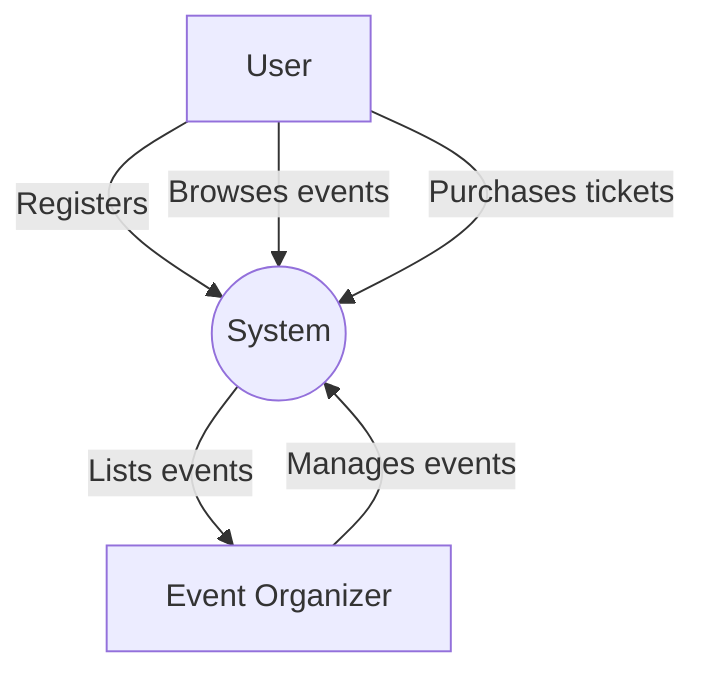
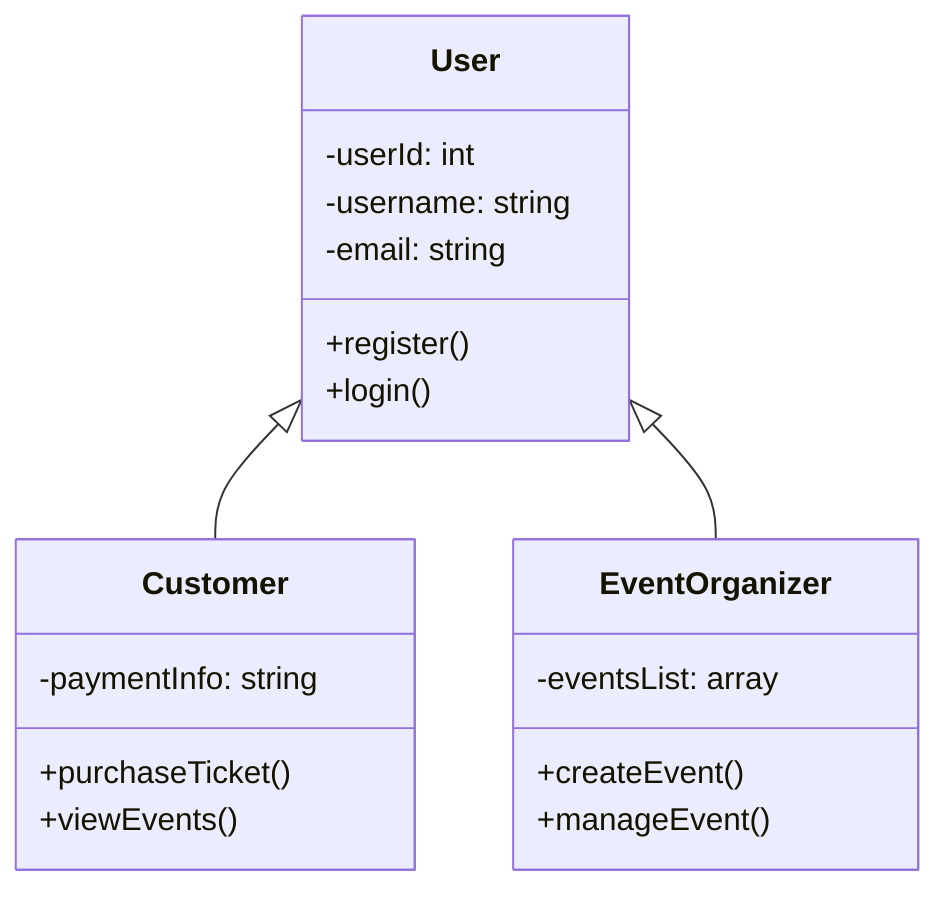
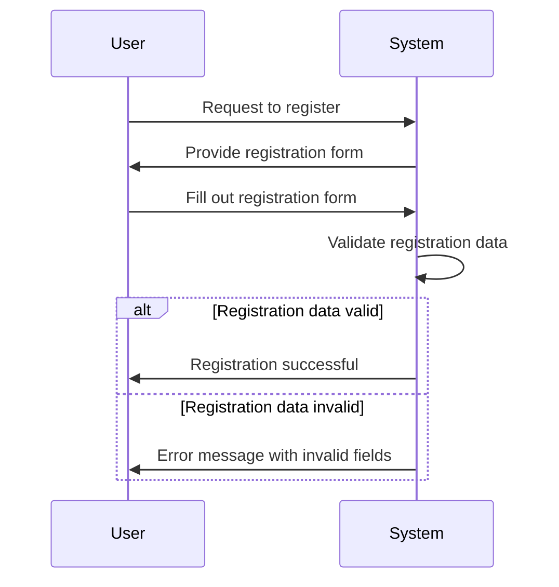
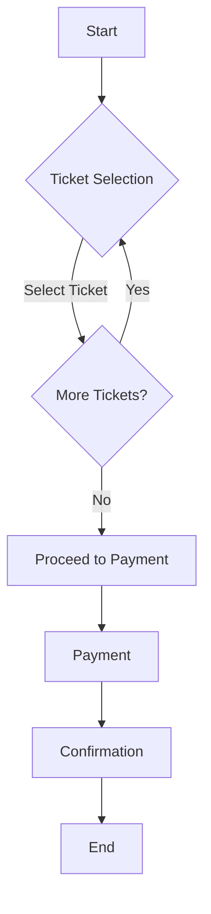
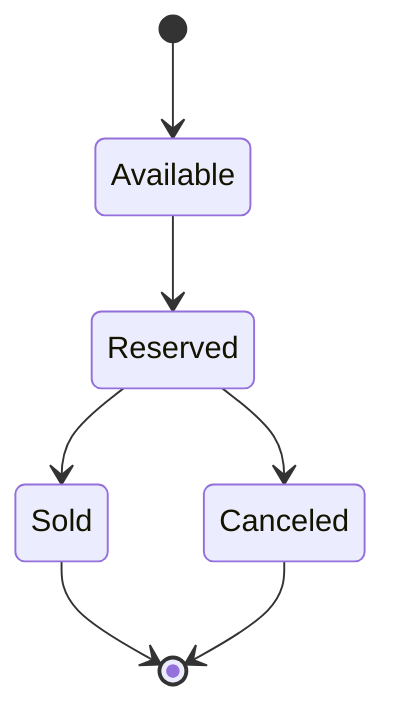

**Software Requirements Specification (SRS) Document**
**Online Ticket Selling Platform**

**Table of Contents**
1. Introduction
2. Requirements Gathering
   - Functional Requirements
   - Non-Functional Requirements
3. System Models
   - Use Case Diagram
   - Class Diagram
   - Sequence Diagram
   - Activity Diagram
   - State Diagram
4. Glossary

**1. Introduction**

**Purpose:**
The purpose of the online ticket selling platform is to provide a user-friendly and efficient system for buying and selling tickets for various events, including concerts, theater performances, sports events, and movies. The platform aims to simplify the process of ticket transactions, making it accessible to both event organizers and customers.

**Scope:**
The scope of the platform includes functionalities such as event listing, ticket purchasing, payment processing, user registration, and profile management. It will support multiple types of events and provide various payment options to users.

**Objectives:**
- To streamline the ticket buying and selling process.
- To provide a secure and efficient platform for both event organizers and customers.
- To offer a wide range of events and ticket options.
- To enhance user experience through intuitive interfaces and features.

**Intended Users:**
The platform is intended for the following users:
- Event Organizers: Individuals or organizations hosting events who wish to list and sell tickets.
- Customers: Individuals interested in purchasing tickets for various events.

**Assumptions and Dependencies:**
- Assumption 1: Users have access to a stable internet connection.
- Assumption 2: Payment gateways and external APIs for event listings are available and functional.
- Dependency 1: Integration with payment gateways for processing transactions.
- Dependency 2: Integration with external APIs for retrieving event listings and details.

**2. Requirements Gathering**

**Functional Requirements:**
1. User Registration:
   - Users should be able to create accounts by providing necessary information.
   - Account activation via email verification should be implemented for security purposes.

2. Event Listing:
   - Event organizers should be able to list their events by providing event details such as name, date, venue, and ticket availability.
   - Events should be categorized based on types (concerts, theater, sports, movies, etc.).

3. Ticket Purchasing:
   - Customers should be able to browse through listed events and purchase tickets.
   - Different ticket types (e.g., VIP, regular) should be available for selection.
   - Quantity selection and seat reservation (if applicable) should be supported.

4. Payment Processing:
   - The platform should support various payment methods such as credit/debit cards, digital wallets, and online banking.
   - Payment processing should be secure and PCI-compliant.

5. User Notifications:
   - Users should receive notifications for account activities (e.g., registration confirmation, ticket purchase confirmation).
   - Event organizers should receive notifications for ticket sales and event updates.

**Non-Functional Requirements:**
1. Performance:
   - The platform should handle concurrent user requests efficiently to prevent system overload.
   - Response times for actions like page loading and transaction processing should be minimal.

2. Security:
   - User data should be encrypted and stored securely.
   - Secure authentication and authorization mechanisms should be implemented.
   - Payment transactions should be encrypted and comply with PCI-DSS standards.

3. Usability:
   - The user interface should be intuitive and user-friendly.
   - Accessibility features should be implemented to cater to users with disabilities.

4. Compatibility:
   - The platform should be compatible with modern web browsers and mobile devices.
   - Cross-browser and cross-device compatibility testing should be conducted.

**3. System Models**

**Use Case Diagram:**

[Include Use Case Diagram]

### Use Case Diagram


**Class Diagram:**

[Include Class Diagram]

### Class Diagram


**Sequence Diagram:**

1. **User Registration:**
[Include Sequence Diagram]


3. **Ticket Purchasing:**
[Include Sequence Diagram]

### Sequence Diagram: User Registration


**Activity Diagram:**

[Include Activity Diagram for Ticket Purchasing Process]

### Activity Diagram: Ticket Purchasing Process


**State Diagram:**

[Include State Diagram for Ticket Lifecycle]

### State Diagram: Ticket Lifecycle


4. **Glossary:**

- **User:** An individual who interacts with the platform, either as an event organizer or a customer.
- **Event Organizer:** A user who lists and manages events on the platform.
- **Customer:** A user who purchases tickets for events listed on the platform.
- **PCI-DSS:** Payment Card Industry Data Security Standard, a set of security standards designed to ensure that all companies that accept, process, store, or transmit credit card information maintain a secure environment.
- **API:** Application Programming Interface, a set of rules and protocols for building and interacting with software applications.
- **Conclusion:** This Software Requirements Specification document outlines the requirements and system models for the development of an online ticket selling platform. By adhering to these specifications, the platform aims to provide a seamless experience for both event organizers and customers while ensuring security, efficiency, and user satisfaction.

```


